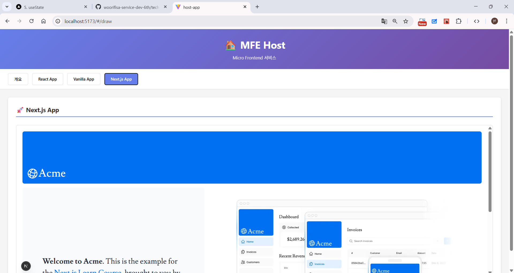

# [우리FISA 6기 기술세미나] Micro Frontends (MFE)

> **MFE (Mad Four Elites) 팀**: 이유림, 박주호, 송민혁, 이건희  
> **프로젝트 목표**: 거대한 서비스를 조립식으로 관리하는 프론트엔드 설계 전략 시연 

---

## 📑 1. MFE Architecture란 무엇인가?

### 등장 배경: Monolithic의 한계 
* **Monolithic**: 하나의 통합된 코드베이스로 여러 비즈니스 기능을 수행하는 전통적인 아키텍처 스타일입니다. 
* **장점**: 빠른 개발, 배포 용이성, 낮은 초기 비용이 특징입니다. 
* **단점**: 규모가 커질수록 배포 및 빌드 속도가 저하되고, 코드 복잡도가 증가하여 협업이 어려워집니다. 

### MFE의 정의 
* 마이크로서비스 아키텍처(MSA)를 프론트엔드까지 확장한 개념입니다. 
* 독립적으로 개발, 테스트, 배포가 가능한 여러 개의 작은 프론트엔드 앱이 모여 하나의 큰 서비스를 구성합니다. 

<br>

## ⚖️ 2. MFE의 장단점 

* **장점**
    * **자율성**: 각 팀이 업무에 적합한 프레임워크와 기술 스택을 독립적으로 선택할 수 있습니다. 
    * **점진적 업그레이드**: 전체 중단 없이 특정 기능만 업데이트하거나 기술 스택을 전환할 수 있습니다. 
    * **독립적 배포**: 개별 앱 단위로 배포가 가능하여 전체 시스템의 위험을 분산합니다. 
* **단점**
    * **운영 복잡성**: 관리해야 할 프로젝트와 배포 파이프라인의 수가 증가합니다. 
    * **리소스 중복**: 각 앱에서 동일한 라이브러리를 중복 로드할 경우 초기 로딩 성능이 저하될 수 있습니다. 

<br>

## 🏗️ 3. 관리 방식: 모노레포 VS 멀티레포 


* **모노레포 (Monorepo)**: 하나의 저장소 내에서 여러 프로젝트를 관리하며 코드 공유와 의존성 관리가 쉽습니다. 
* **멀티레포 (Multirepo)**: 프로젝트마다 독립된 저장소를 사용하여 팀 간 간섭을 최소화하고 독립성을 극대화합니다. 

<br>

## 🛠️ 4. MFE 구현 방식 비교 

### 방식 1: iframe
* 별도의 브라우징 컨텍스트 내에서 독립적인 HTML 문서를 삽입하는 방식입니다. 
* **특징**: 앱 간의 격리성이 완벽하여 변수나 스타일 충돌이 전혀 없습니다. 
* **한계**: 검색 엔진 최적화(SEO)가 어렵고, 브라우저 뒤로가기 연동 등 사용자 경험(UX) 측면의 제약이 있습니다. 

### 방식 2: Module Federation
* Webpack 5에서 도입된 기술로, 런타임에 독립적인 빌드 결과물(Remote)을 동적으로 로드합니다. 
* **특징**: 공통 라이브러리(React 등)를 공유하여 리소스 효율이 높고, 하나의 SPA처럼 매끄럽게 동작합니다. 

---

## 🚀 프로그램 시연 가이드

구조적 특성상 아래 순서대로 각 포트에서 앱을 실행해야 통합 화면이 정상 동작합니다.

### 1단계: 하위 앱(Remote) 실행
```bash
# 1. 드로우 앱 (Port 5005)
cd draw-app && npm i && npm run build && npm run preview

# 2. 바닐라 앱 (Port 5002 - Host이자 Remote 역할)
cd vanilla-app && npm i && npm run build && npm run preview

# 3. 넥스트js 앱 (Port 5003)
cd nextjs-app && npm i && npm run dev

# 4. 리액트 앱 (Port 5001 - Host 앱)
cd react-app && npm i && npm run dev

# 5. 호스트 앱 (진입점 - Port 5173)
cd host-app && npm i && npm run dev
```

👉 모든 서버 실행 후 http://localhost:5173 으로 접속합니다.

---

## 🖼️ 실행 결과
* 메인 홈: 전체 서비스의 관문 역할을 수행합니다.
* React App: iframe 방식을 통해 통합된 화면을 시연합니다. 
* Vanilla App: Module Federation을 통해 유기적으로 결합된 상태를 보여줍니다. 

---

# 프로그램 실행결과 이미지

> **메인 홈화면**


<br>

> **리액트 앱 실행화면**


<br>

> **바닐라 앱 실행화면**


<br>

> **Nextjs 앱 실행화면**



---

## 👥 Team Member

| Member | Role | GitHub |
| :--- | :--- | :--- |
| **이유림** | 팀장 / Module Federation 담당 | [@urimL](https://github.com/urimL) |
| **박주호** | MFE 아키텍처 분석 담당 | [@jooho2075](https://github.com/jooho2075) |
| **이건희** | iframe 담당 | [@give-and-take](https://github.com/give-and-take) |
| **송민혁** | MFE 인프라 구성 | [@S0NGMinHyuk](https://github.com/S0NGMinHyuk/) |

---
© 2026 Team MFE. All Rights Reserved.